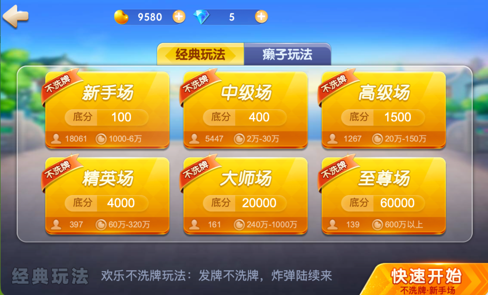
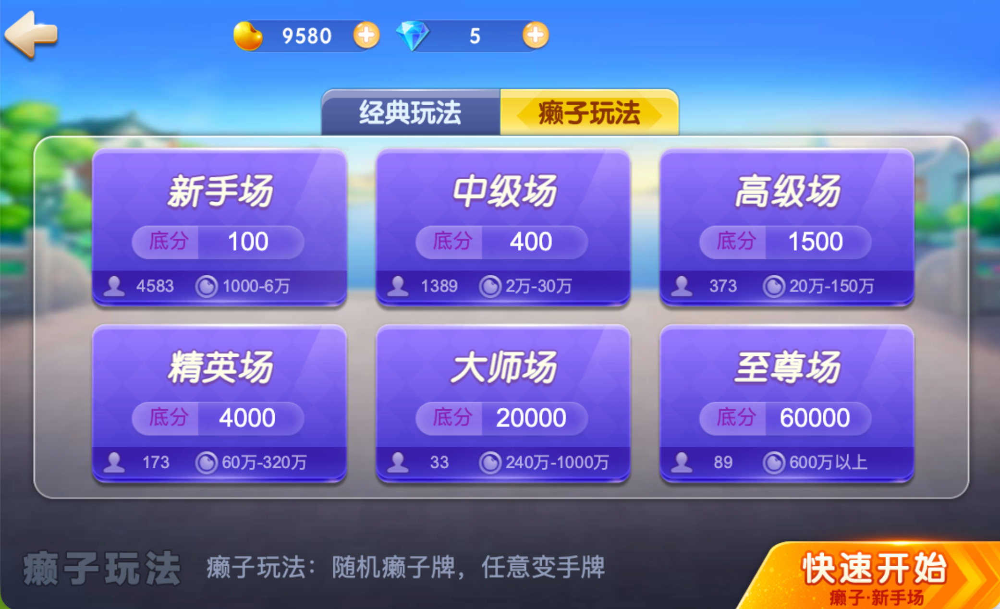
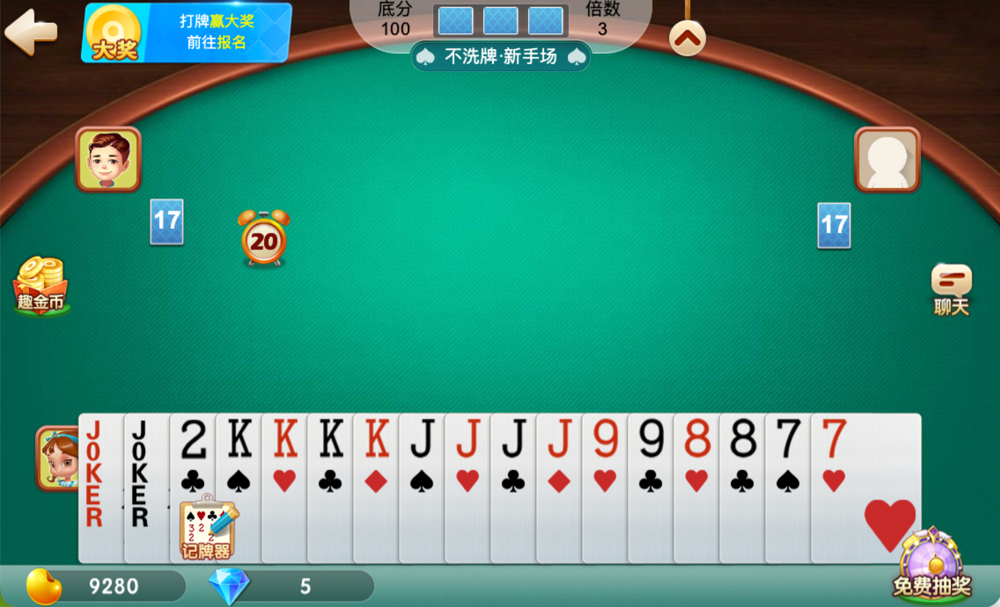
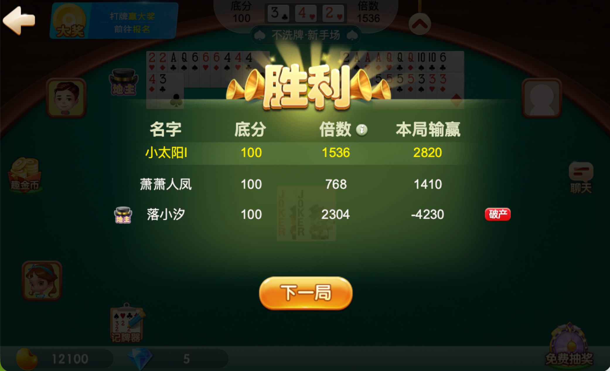
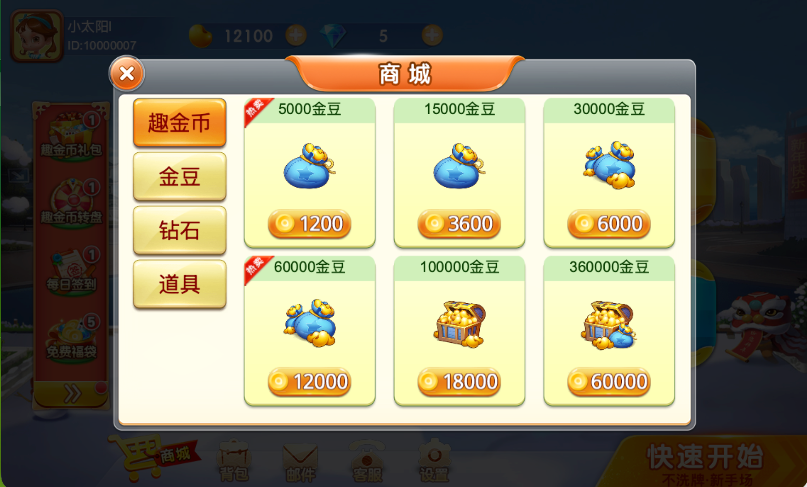
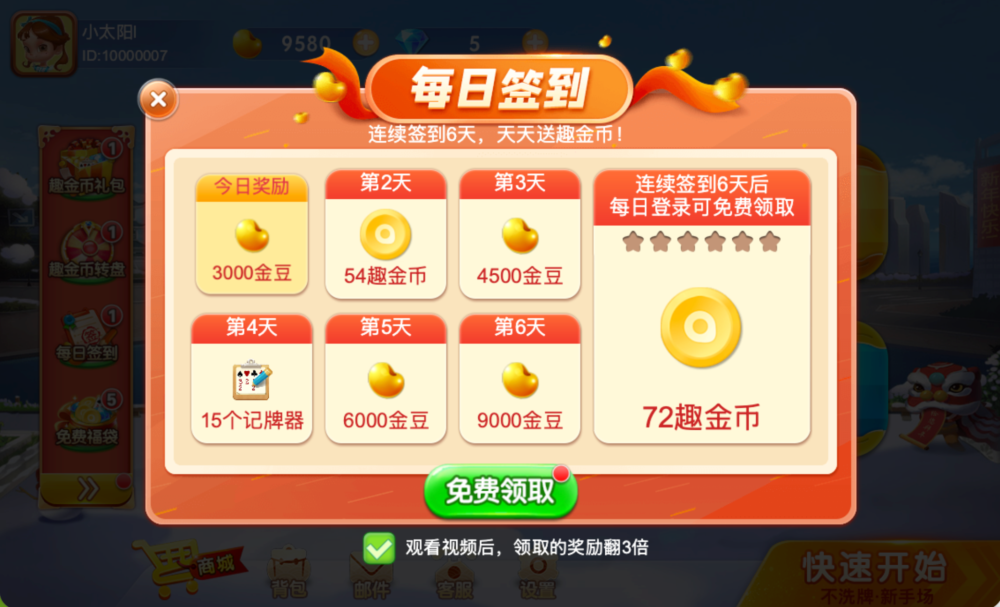
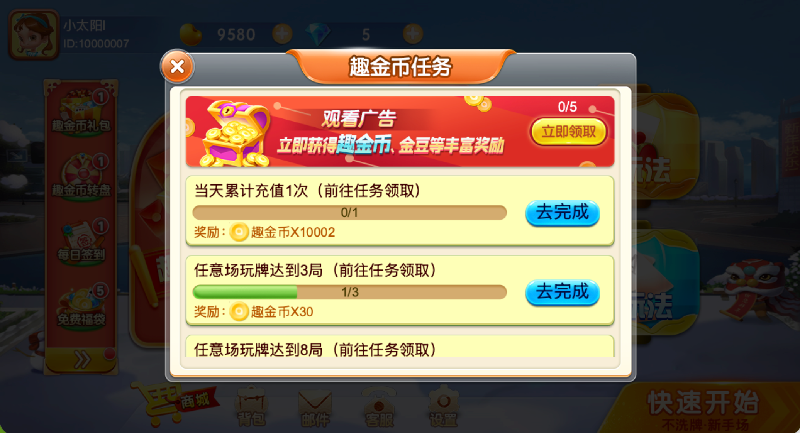
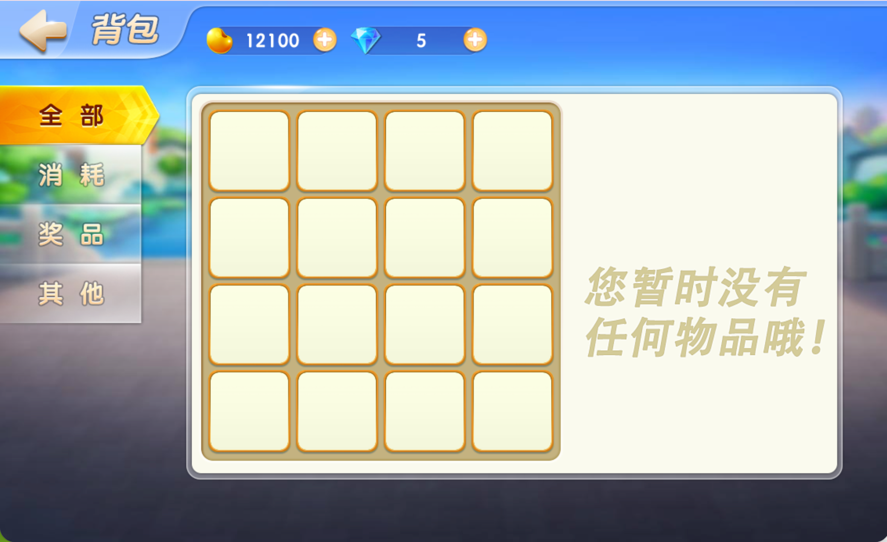
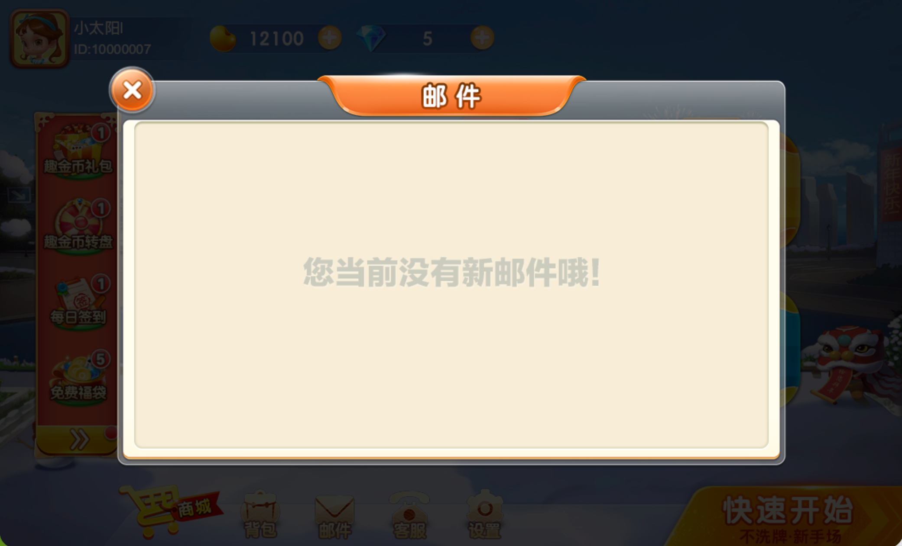
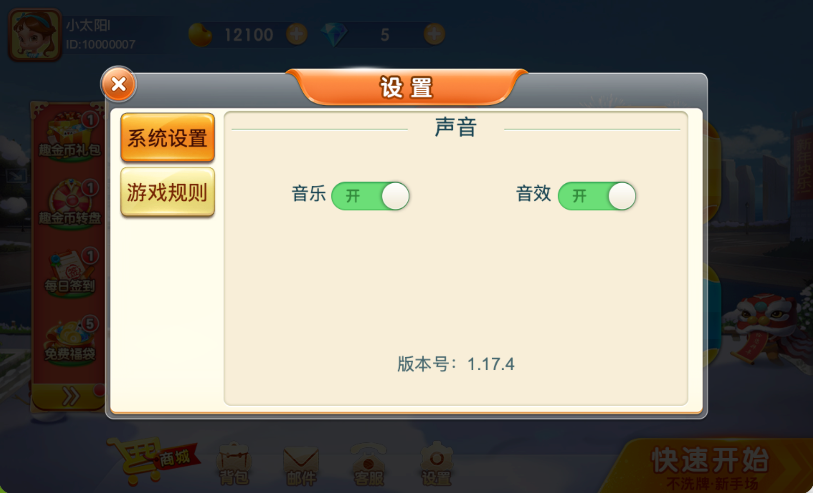

# 运营级斗地主项目

---

## 项目简介

这是一款**运营级斗地主小游戏**，支持经典玩法与癞子玩法，三人同桌、叫抢地主、加倍出牌，配有智能 AI 陪玩与多场次自动匹配。大厅集成商城充值、每日签到、免费抽奖、大奖赛、排行榜、邀请有礼等丰富活动，覆盖微信小游戏、H5 及安卓多渠道。项目包含客户端与服务端完整源码，历经线上长期运营验证，玩法成熟、功能齐全，适合快速上线或二次开发。

> **完整源码请联系 VX: dayongchuhai**

---

## 功能列表

### 游戏核心

- 经典斗地主（叫地主 / 抢地主 / 加倍 / 出牌）
- 癞子斗地主
- 多房间、多场次（按金币区间划分）
- 真人匹配 + 机器人陪玩
- 智能 AI 出牌（多档难度、玩家节奏控制）
- 牌局托管
- 牌局内聊天
- 牌局结算与战绩展示
- 破产补助 / 金币接济
- 游戏规则说明

### 竞技与排行

- 大奖赛（报名、赛程、奖励）
- 排行榜（日榜 / 周榜 / 赛季）
- 排名奖励发放

### 商城与充值

- 金币商城
- 道具购买
- 首充礼包
- 狂欢礼包
- 微信支付
- 广告补助领金币

### 活动与福利

- 活动中心（限时活动、节日活动）
- 每日签到
- 免费抽奖
- 幸运转一转
- 每日寻宝（转盘）
- 免费福袋
- 趣金币礼包
- 白送趣金币
- 免费拿话费
- 邀请有礼
- 分享奖励
- 渠道专属活动（趣头条等）
- 平台联动活动

### 任务系统

- 日常任务
- 趣金币任务
- 渠道任务（趣头条任务等）
- 限时任务

### 用户系统

- 账号注册 / 登录
- 微信授权登录
- 玩家信息（头像、昵称、金币、战绩）
- 修改昵称
- 背包（道具查看、使用、合成、出售）
- 邮件（系统通知、奖励领取）
- 客服中心（在线反馈、常见问题、电话客服）
- 系统公告
- 设置（音效、规则、协议等）

### 运营支撑

- 服务端热更新（逻辑 / 配置 / 协议）
- 登录白名单（灰度发布）
- 全链路数据埋点（登录、注册、牌局、支付、资源变动等）
- 用户分群（签到、抽奖、排行榜等按群配置）
- 多渠道打包（微信、趣头条、OPPO、VIVO、华为、小米等）
- GM 调试工具（资源增减、牌桌测试、节奏测试、支付测试等）
- 客户端日志上报

---

## 技术架构

客户端基于 LayaAir 引擎，服务端基于 Skynet 分布式架构，支持 H5、微信小游戏及多渠道发布，前后端通过 Protobuf 协议通信。

---

## 联系方式

**完整源码、技术咨询、定制开发请联系：**

**VX: dayongchuhai**
