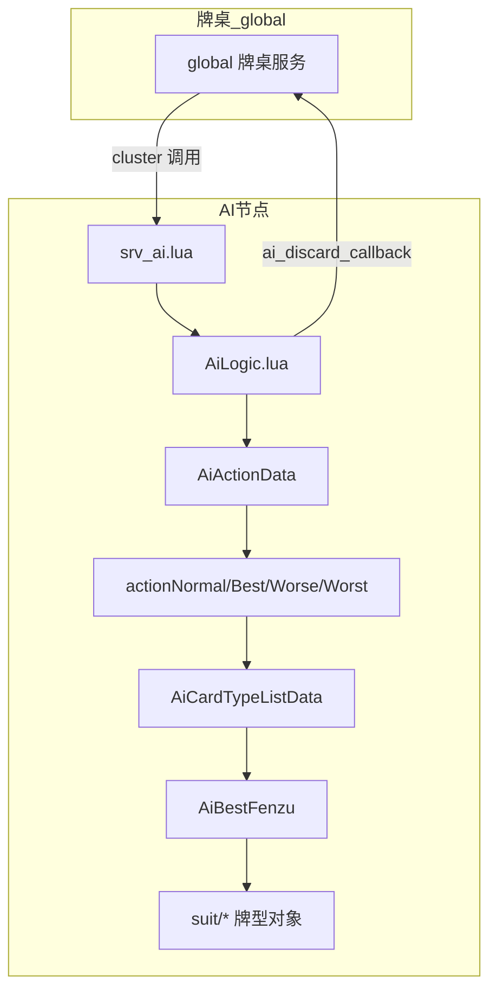
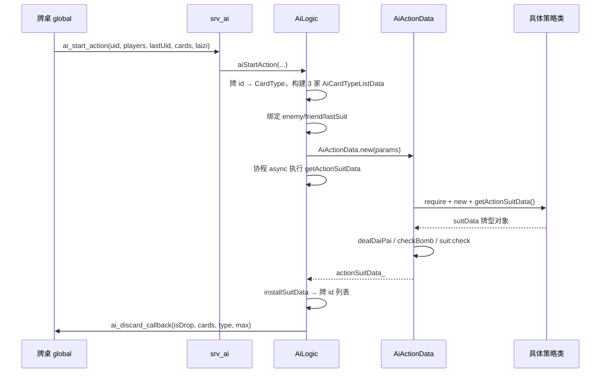
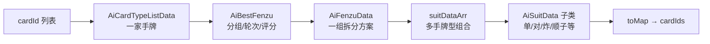

# 斗地主 AI 流程分析

> 基于 `ai_decompiled/` 反编译明文整理。线上运行仍加载 `ai/` 目录下的 **Lua 5.3 字节码**；本文档用于阅读与改逻辑参考。

---

## 1. 总体架构

AI 节点（`ai1`）通过 Skynet 服务对外提供三类能力：

| 接口 | 入口文件 | 作用 |
|------|----------|------|
| `ai_start_action` | `AiLogic.lua` → `aiStartAction` | 机器人/AI **出牌**（核心） |
| `player_host_action` | `AiLogic.lua` → `playerHostAction` | **托管**简化出牌 |
| `player_init_lun` / `player_get_lun` | `AiLogic.lua` → `aiInitLun` | 叫地主/抢地主/加倍阶段的 **手牌轮次(lun) 评估** |

发牌逻辑在 **明文** 模块 `DealCardManager.lua` / `DealCardModel*.lua`，与 `ai/` 出牌决策分离。



---

## 2. 座位与关系模型

三人斗地主固定 **方位 direction**：

| direction | 角色 | 关系字段 |
|-----------|------|----------|
| 1 | 地主 | `enemy1`=下家农民, `enemy2`=上家农民 |
| 2 | 下家农民 | `enemy1`=地主, `friend`=上家农民 |
| 3 | 上家农民 | `enemy1`=地主, `friend`=下家农民 |

`aiStartAction` 为每个玩家构建 `AiCardTypeListData`（手牌抽象），并写入 `enemy1` / `enemy2` / `friend` / `lastSuitData`（上一手牌型）。

---

## 3. AI 等级（aiLevel）与策略类映射

`AiActionData:getActionNameMap()` 按 **aiLevel(1~7)** × **direction(1~3)** 选择具体策略类：

| aiLevel | 强度 | 策略包 | 说明 |
|---------|------|--------|------|
| 1 ~ 4 | 强 | `actionBest/*` | 最优/接近最优出牌 |
| 5 | 中 | `actionNormal/*` | 常规 AI，含攻守姿态 |
| 6 | 弱 | `actionWorse/*` | 较差决策 |
| 7 | 最弱 | `actionWorst/*` | 几乎只出「最优分组」里的牌，逻辑最简单 |

每种组合有两个类：

- **Start**：轮到自己首出（`lastSuitData == nil`）
- **Follow**：跟牌（有 `lastSuitData`）

示例（农民上家，aiLevel=5）：

- 首出：`ai.actionNormal.AiNormalFarmerLeftStartData`
- 跟牌：`ai.actionNormal.AiNormalFarmerLeftFollowData`

---

## 4. 主流程：出牌 `aiStartAction`



### 4.1 关键步骤说明

1. **上一手牌**  
   若 `lastUid == 自己`，视为新一圈，清空 `lastSuitData`。否则用 `AiCardListData` 把 `lastSuitCardIds` 转成 `AiSuitData`。

2. **异步计算**  
   `AiUtils:async` + 协程；`AiCardTypeListData` 在 `async=true` 时，`AiBestFenzu` 等重计算会 `coroutine.yield()`，避免阻塞 Skynet 线程过久。

3. **AiActionData:getActionSuitData()**（调度核心）

```text
根据 aiLevel + direction + 是否有 lastSuitData
  → require 对应 Start/Follow 类
  → actionData:getActionSuitData()
  → dealDaiPai（带牌/附带出牌处理）
  → 若 aiLevel < 7：checkIsBombAndIsEnemyWinCondition（炸弹与赢牌条件修正）
  → suitData:check(lastSuitData) 合法性校验
  → 若无结果且为首出：normolStart() 兜底
```

4. **回调**  
   将 `AiSuitData` 转回客户端牌 id，通过 `game_util.send_global(..., "ai_discard_callback", ...)` 通知牌桌。

---

## 5. 数据层：从手牌到「出一手牌」



### 5.1 `AiCardTypeListData`（手牌大脑）

核心职责：

| 方法 | 作用 |
|------|------|
| `ai_getBestFenzu()` | 创建并缓存 `AiBestFenzu`（全牌型枚举 + 分组） |
| `ai_getBestFenzuData()` | 取最优一组拆牌方案 `AiFenzuData` |
| `ai_doDeepBestSuitDataArr()` | 深度搜索更优拆法（考虑 lastSuit、taskData） |
| `ai_getBestSuitDataArr()` | 当前最优分组下的各手牌组合 |
| `ai_getWinConditions()` | 「一手出完」类收官组合 |
| `ai_getEnableEnd()` | 是否存在收官可能 |
| `ai_all_filterBiggerSuitDataArr()` | 能压过上家的所有牌型 |
| `ai_isMatchWinCondition()` | 某牌型是否属于赢牌路径 |

### 5.2 `AiBestFenzu`（最优分组引擎）

构造时依次：

1. `initAllSuit` — 枚举手牌所有合法牌型（`suit/*`）
2. `initSortMark` — 标记大小关系、炸弹消耗等
3. `initAllFenzu` — 生成多种 **分组方案**（拆法）
4. `sortAllFenzuInfo` — 按 `lun`（轮次）、`score` 等排序

输出 `getBestFenzuInfo()` → 最优拆法，供后续「首出列表」「收官」使用。

`getDeepBestFenzuData` 在多个分组间做更深筛选（含炸弹全炸、任务牌型等分支）。

### 5.3 `suit/*`（牌型类）

每种牌型一个类，继承 `AiSuitData`，例如：

- `AiSuitSingleData`、`AiSuitPairData`、`AiSuitBombData`
- `AiSuitStraightData`、`AiSuitThreeWithOnePairData` …

负责：牌型判定、`getLevel`、`getScore`、`isWin`、与癞子 `lazi` 配合等。

### 5.4 `AiUtils`

工具集：异步协程、牌型过滤/交集、四带二拆分、炸弹判断、`getMinSuitDataWithArr` 等，被各层策略大量调用。

---

## 6. 策略层继承关系

```text
AiActionData                    ← 调度、后处理、公共查询
├── AiLandlordStartData         ← 地主首出基类（getBaseActionSuitData）
├── AiLandlordFollowData        ← 地主跟牌基类
├── AiFarmerRightStartData      ← 下家农民首出基类
├── AiFarmerRightFollowData
├── AiFarmerLeftStartData       ← 上家农民首出基类
└── AiFarmerLeftFollowData

actionBest/*    → 继承对应 actionBase，强化进攻/防守/收官
actionNormal/*  → 继承 actionBase，增加 getStatus 攻守姿态
actionWorse/*   → 弱化版
actionWorst/*   → 仅 setFirstSuitDataArr(最优分组) + getBaseActionSuitData
```

**actionBase** 提供通用骨架，例如地主首出 `getBaseActionSuitData()`：

- 读 `firstSuitDataArr`（优先出牌列表）
- 全单张且对手剩 1 张 → 特殊防报单逻辑
- 否则 `getStartBaseActionSuitData()`（从列表中用 A0/A1/A2/A3 规则挑一手最小的合适牌）

**actionNormal** 在此基础上增加典型分支（以上家农民首出为例）：

```text
getActionSuitData()
  ├─ ai_doDeepBestSuitDataArr()     深度最优分组
  ├─ enableEnd() → getEndActionSuitData()   收官
  ├─ checkBestSuitIsTwo() → getLeftTwoSuitData()
  ├─ getStatus() → 0 防守 / 1 进攻
  │     ├─ 0 → getPreventStatusActionSuitData()
  │     └─ 1 → getAttackStatusActionSuitData()
  └─ （Follow 类另有压牌、拆牌、让牌等大量分支）
```

`getStatus()`（上家农民）：比较自己与队友的 `lun_`（分组轮次），队友是机器人时阈值更松，用于决定偏防守还是偏进攻。

**actionWorst**（最弱）：几乎不做复杂搜索，直接把 `ai_getBestSuitDataArr()` 设为优先列表后走基类 `getBaseActionSuitData()`。

---

## 7. 跟牌（Follow）与首出（Start）差异

| 维度 | Start | Follow |
|------|-------|--------|
| 触发条件 | `lastSuitData == nil` | 有上一手牌型 |
| 首要目标 | 选「优先出的牌组合列表」首手 | 在能压过的牌中选一手 |
| 典型方法 | `getStartBaseActionSuitData` | `getFollowBaseActionSuitData`、`enableFollow` |
| Normal 类 | 收官、攻守姿态、深度分组 | 压牌、拆小牌、不拆炸弹、让队友等 |

Follow 会先 `ai_all_filterBiggerSuitDataArr(lastSuitData)`，再在更大集合里做拆分、过滤炸弹、选最小压牌等（逻辑分布在各 `*FollowData` 数百行中）。

---

## 8. 托管出牌 `playerHostAction`

不走 `AiActionData` 等级策略，路径更短：

```text
AiCardListData.new(手牌)
  → getSuitDataForHost(lastDiscard)
  → 直接回调 ai_discard_callback
```

适合玩家托管时的简单规则出牌。

---

## 9. 叫地主/加倍：`aiInitLun`

仅对 **robot=true** 的玩家计算：

```text
构建 cardTypeListDataArr（加倍阶段有 friend 关系，叫地主阶段全员 enemy）
  → AiBestFenzu.new
  → getBestFenzuInfo().lun
  → 存入 resultLun_[uid]
```

牌桌通过 `player_get_lun` 读取，用于机器人叫分/加倍决策（具体阈值在牌桌逻辑，不在 ai_decompiled 内）。

---

## 10. 发牌（独立模块）

| 文件 | 作用 |
|------|------|
| `DealCardManager.lua` | 按权重选发牌模型 |
| `DealCardModelData.lua` | 模型配置、生成牌型分布 |
| `DealCardModelSubData.lua` | 子模型 |

与出牌 AI **无直接 require 关系**；牌桌在开局阶段调用发牌服务，再把 `cards` 传给 AI。

---

## 11. 目录结构速查

```text
ai_server/
├── AiLogic.lua              # 出牌/托管/轮次 入口（明文）
├── AiInit.lua               # require 所有 ai 模块（明文）
├── DealCard*.lua            # 发牌（明文）
├── srv/srv_ai.lua           # Skynet 命令分发（明文）
└── ai/                      # 运行时字节码（本目录为 decompiled 明文）
    ├── AiActionData.lua     # 等级×方位 调度
    ├── AiCardTypeListData.lua
    ├── AiBestFenzu.lua      # 分组引擎（最重）
    ├── AiUtils.lua
    ├── AiCardData / AiCardListData / AiFenzuData / AiSuitData
    ├── actionBase/          # 6 个基类（地主/农民 × 首出/跟牌）
    ├── actionBest/          # 强 AI（等级 1-4）
    ├── actionNormal/        # 中 AI（等级 5）
    ├── actionWorse/         # 弱 AI（等级 6）
    ├── actionWorst/         # 最弱（等级 7）
    └── suit/                # 各牌型 AiSuit*Data
```

---

## 12. 调试与日志

- `AiInit.lua` 中 `kIsDebug = 1` 时，策略里 `self.log(...)` 会写入 `logStrList`，出错打印到 skynet。
- 日志里常见标记：`【优先出的牌组合列表】`、`==标记路径`、`深度最优分组`、`收官` 等，对应 `addParamsWithKey` / `result` 路径追踪。

---

## 13. 修改 AI 时的建议切入点

| 目标 | 建议修改位置 |
|------|----------------|
| 整体变强/变弱 | 牌桌传入的 `aiLevel`，或 `getActionNameMap` 映射 |
| 拆牌/轮次评价 | `AiBestFenzu.lua`、`AiFenzuData.lua` |
| 某种牌型规则 | `suit/AiSuit*.lua` |
| 农民协作、防守进攻 | `actionNormal/AiNormalFarmer*Data.lua` |
| 最弱机器人行为 | `actionWorst/*`（逻辑最少，易改） |
| 出牌合法性/带牌 | `AiActionData:dealDaiPai`、`check` |
| 发牌质量 | `DealCardManager.lua`（明文，非 ai_decompiled） |

改 `ai_decompiled` 后需 **luac 编译回 bytecode** 或改 `AiInit` 路径加载明文，并重启 **ai 节点**。

---

## 14. 相关工具

| 脚本 | 作用 |
|------|------|
| `tools/decompile_ai.sh` | bytecode → `ai_decompiled/`，并链式执行中文修复与注释排版 |
| `tools/fix_decompiled_chinese.py` | `\228\187...` 转中文日志字符串 |
| `tools/format_comment_ai_decompiled.py` | 每个函数上方添加 `-- 中文说明` |
| `tools/format_ai_decompiled.sh` | 注释 + StyLua 格式化（见下） |

### 14.1 代码格式化与注释

- 已为 **52 个** `.lua` 在**每个 `function` 前**增加 `--` 中文注释（约 726 处），说明含：角色（地主/农民/强弱 AI）、方法用途、首条 `self.log` 摘要。
- **37 个**文件经 [StyLua](https://github.com/JohnnyMorganz/StyLua) 统一为 2 空格缩进；配置见 `ai_decompiled/.stylua.toml`。
- **15 个** `actionBest` / `actionNormal` / 部分 `actionWorse` 因反编译残留 `goto`、多余 `else` 无法被 StyLua 解析，仅做行尾去空格、空行整理；**不影响阅读**，但与字节码逻辑一致，不宜直接当可运行源码。

重新生成注释与排版：

```bash
cd ddzserver
python3 tools/format_comment_ai_decompiled.py
sh tools/format_ai_decompiled.sh
```

---

*文档生成说明：流程以 `AiLogic.lua` + `ai_decompiled` 为准；牌桌侧调用参数名见 `srv_ai.lua` 与 global 牌桌服务。*
